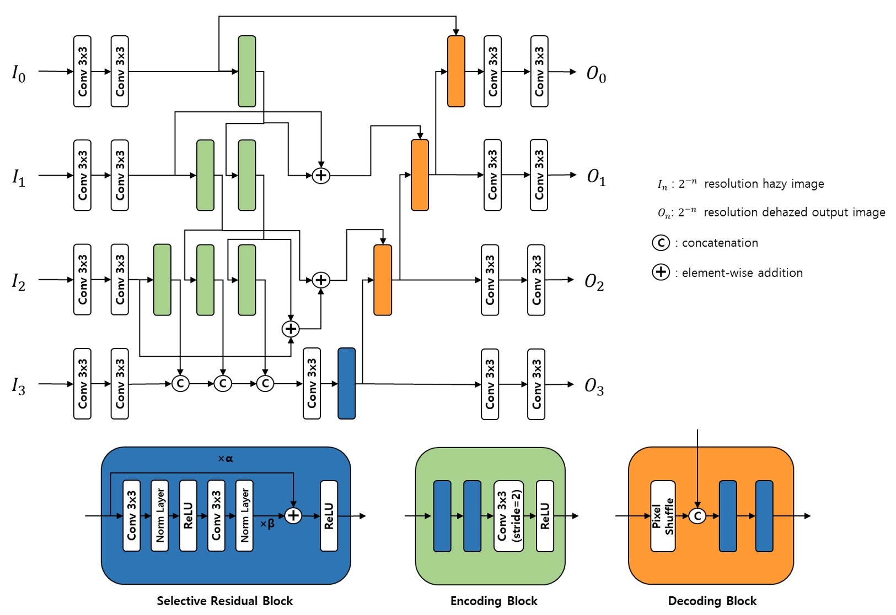

# NTIRE 2021 NonHomogeneous Dehazing Challenge: UNIST VIP Lab
## Introduction
This is our project repository for CVPR 2021 workshop.

**"Multi-scale Selective Residual Learning for Single Image Dehazing"**

## Network Architecture


## Dataset Preparation
You can download **NTIRE 2021 NonHomogeneous Dehazing Challenge** dataset after participating the challenge in the following link:
[https://competitions.codalab.org/competitions/28032](https://competitions.codalab.org/competitions/28032)

Your dataset directory should be composed of three directories like following:
```bash
dataset_directory
|-- train
|   |-- HAZY
|   |   |-- 01
|   |   |-- 02
|   |   `-- ...
|   `-- GT
|       |-- 01
|       |-- 02
|       `-- ...
|-- val
|   |-- HAZY
|   |   `-- ...
|   `-- GT
|       `-- ...
`-- test
    `-- HAZY
        `-- ...
```

## Train
You can start training your model by following:
```
$ python main.py train
Additional arguments:
    --data-dir: Dataset directory
    --gpus: Invidual GPU number(s) to use(e.g. 0,1,2)
    --name: Name of the experiment
    --batch-size: Training batch size
    --epochs: The number of total epochs
    --lr: Initial learning rate
    --lr-mode: Learning rate scheduling mode
    --step: Step size for learning rate decay
    --weight-decay: Weight decay factor
    --crop-size: Random crop size for data augmentation
    --random-scale: Random scaling ratio for data augmentation
    --random-rotate: Random rotating degree for data augmentation
    --random-identity-mapping: Random identity mapping ratio for data augmentation
```


## Test
You can test your pretrained model by following:
```
$ python main.py test -d [data path] --resume [pretrained model path] --phase test --batch-size 1
```

Download pretrained model: [[download](https://drive.google.com/file/d/1LaGob83XbpoWDi5peaPUoZExnLnAOC5L/view?usp=sharing)]

<!-- ## Results
| Metrics | Test Scores (#51~55)
|:----:|:----:|
| PSNR | 18.77 |
| SSIM | 0.54 |
| Run time[s] per img. | 0.04 | | -->

Download qualitative results of the pretrained model: [[download](https://drive.google.com/file/d/1hGQzj8Uyxku1UHKyABfwqjRUkmKlby9G/view?usp=sharing)]
